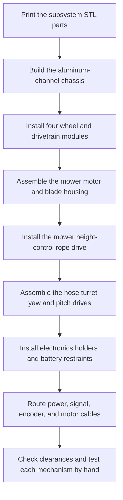
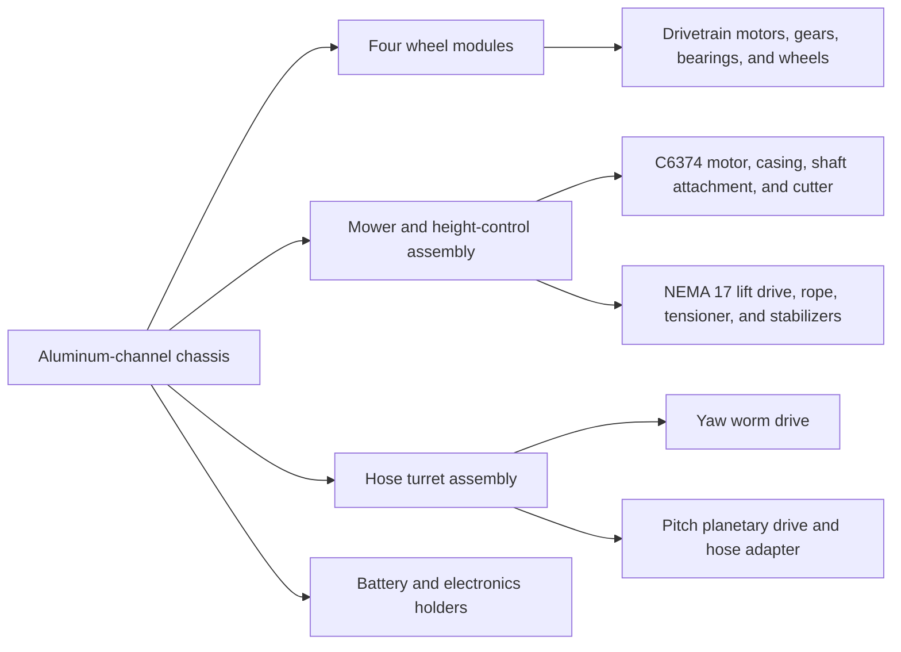
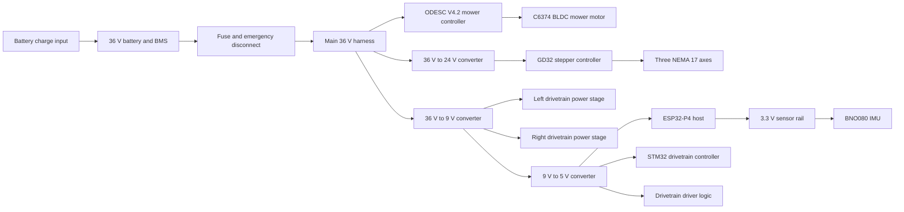
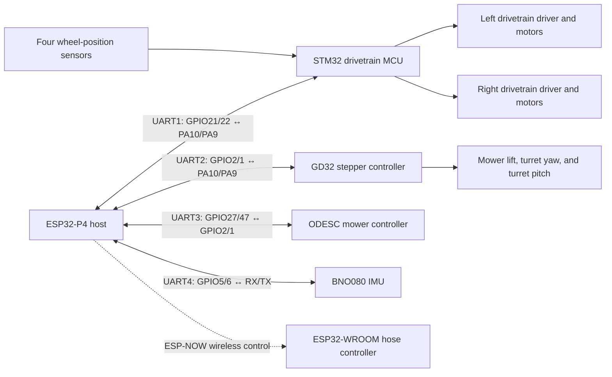

# Autonomous Garden Rover build instructions

This guide covers the mechanical assembly, electrical system, controller architecture, firmware flashing, and bill of materials for the Autonomous Garden Rover. The complete development process is documented in the [Macondo journal](https://macondo.hackclub.com/projects/9276).

Useful project files:

- [Fusion 360 assembly and STEP files](CAD/Assembly/)
- [Printable STL files grouped by subsystem](CAD/Individual%20Printable%20STLs/)
- [KiCad block-level schematic](Schematics/Block-level%20schematic/)
- [Firmware source and flash images](firmware/)

> [!CAUTION]
> Disconnect the battery before changing wiring or working near the mower. Fit an appropriately rated fuse and emergency disconnect, insulate every exposed power connection, and test with the cutting attachment removed. The 36 V battery and high-power mower can cause fire or serious injury if wired or operated incorrectly.

## Mechanical build


### Mechanical assembly order



### Major mechanical groups



1. **Print and sort the parts.** Use the folders under [`CAD/Individual Printable STLs/`](CAD/Individual%20Printable%20STLs/) to keep the structural, wheel, mower, height-control, turret, hose-control, and electronics-holder parts separated. Check bearing, shaft, and fastener fit before a long print run.
2. **Build the chassis.** Cut and assemble the 3/4-inch aluminum channels to match the [`CAD/Assembly/`](CAD/Assembly/) model. Install the printed structural mounts and couplers, square the frame, and confirm that it rests flat before tightening it fully.
3. **Install the drivetrain.** Assemble each drivetrain motor holder, casing, spur gear, output gear, bearings, and wheel. Mount all four wheel modules to the chassis. Turn each wheel by hand and correct binding or gear misalignment before applying power.
4. **Build the mower.** Assemble the mower casing, C6374 mount, shaft attachment, and selected cutting attachment. Install the height-control components, including the NEMA 17 gearbox, rope drum and guides, tensioner, and stabilizers. Test the full vertical travel without a blade fitted.
5. **Build the hose turret.** Assemble the yaw worm drive, pitch planetary drive, bearing supports, and hose adapters. Confirm that both axes travel freely and cannot pull or kink the hose.
6. **Mount the battery and electronics.** Fit the battery restraints and printed holders for the main electronics, ODESC, and stepper controller. Keep high-current hardware separated from low-voltage signal wiring and leave access to programming connectors.
7. **Route the harness.** Secure cables away from gears, wheels, rope, the mower shaft, and turret travel. Leave service loops at moving joints and add strain relief at every motor, sensor, and controller connector.

## Electrical build

The diagram below summarizes the power rails shown in the KiCad design. Confirm the input and output voltage of every converter with a multimeter before connecting a controller.

### Power distribution



### Controller and signal wiring




The editable KiCad source is in [`Schematics/Block-level schematic/`](Schematics/Block-level%20schematic/).

### Wiring procedure

1. **Build the power harness with the battery disconnected.** Use wire, connectors, fusing, and a disconnect rated for the expected voltage and current. Keep a common ground between the 36 V, 24 V, 9 V, 5 V, and 3.3 V systems.
2. **Set the converters before connecting electronics.** Adjust and verify the 24 V, 9 V, and 5 V rails under no load. Reverse polarity or an incorrectly adjusted converter can destroy a controller immediately.
3. **Connect one subsystem at a time.** Start with the ESP32-P4 and STM32 drivetrain controller, then add the BNO080, GD32 board, ODESC, and hose controller. Check for excess current or heating after each addition.
4. **Cross UART transmit and receive.** Each controller's TX connects to the other controller's RX. Connect the grounds as well. Follow the pin labels in the signal diagram and KiCad schematic.
5. **Connect motors with cutting hardware removed.** Verify drivetrain direction, stepper direction and limits, and BLDC feedback before fitting the mower attachment.
6. **Inspect the completed harness.** Check polarity, continuity, exposed conductors, strain relief, connector retention, cable clearance, and emergency-disconnect operation.

## System architecture

There is one host computer and several subsystem computers that control the rover. Each onboard subsystem is linked to the host controller over UART. The host could be replaced with another computer, such as a Raspberry Pi running ROS 2, if it implements the same subsystem links.

| Subsystem       | Hardware               | Purpose                                      |
| --------------- | ---------------------- | -------------------------------------------- |
| Main controller | ESP32-P4 + ESP32-C6    | Controls AI processing and autonomy          |
| Drivetrain      | STM32F103              | Controls the drivetrain and encoder feedback |
| Stepper motion  | GD32F303 Ender-3 board | Controls mower height and turret axes        |
| Mower           | STM32 ODrive clone     | Controls the C6374 mowing motor               |
| IMU             | BNO080                 | Provides 9-axis motion sensing                |
| Hose valve      | ESP32-WROOM-32         | Provides wireless faucet control              |

### Why use several subsystem controllers?

I also designed a single-board host computer that combines the major electronics onto one PCB, with connectors for each peripheral. It has not been manufactured or tested yet, but it is an option for builders who want to avoid the separate subsystem wiring and communication links.

[**Single-board host computer schematic and PCB files**](Schematics/Prototype%20single%20board%20host%20computer/)

The current distributed layout is significantly cheaper, which helps keep the project under the $400 budget, and easier to repair because each mass-produced controller can be replaced independently.

## Flashing the firmware

Compiled firmware images for each rover controller are in [`firmware/`](firmware/). The corresponding `source/` folders contain the code for custom builds.

### ESP32-P4 main controller

Firmware: [`firmware/esp32-p4/images/esp32-p4-complete.bin`](firmware/esp32-p4/images/esp32-p4-complete.bin)

Install [esptool](https://docs.espressif.com/projects/esptool/en/latest/esp32p4/installation.html), connect the ESP32-P4, and run:

```sh
esptool --chip esp32p4 --port COM3 erase-flash
esptool --chip esp32p4 --port COM3 write-flash 0x0 firmware/esp32-p4/images/esp32-p4-complete.bin
```

Replace `COM3` with the serial port used by your board. The public image uses
the example all-zero controller key. For authenticated handheld control, create
an ignored `source/main/rover_control_key.h`, rebuild locally, and keep any
private image under a `*-private.bin` filename so the root `.gitignore` excludes
it.

### STM32 drivetrain controller

Firmware: [`firmware/stm32-drive/images/firmware.bin`](firmware/stm32-drive/images/firmware.bin)

You need an ST-Link to program the STM32F103. This video demonstrates the wiring and setup: [How to connect and use an ST-Link](https://www.youtube.com/watch?v=KgR3uM21y7o).

1. Connect the ST-Link to the STM32F103 over SWD.
2. Open STM32CubeProgrammer.
3. Connect using ST-Link/SWD.
4. Select `firmware.bin`.
5. Flash it at `0x08000000`.

### GD32 stepper controller

Firmware: [`firmware/gd32-stepper/images/GD3P4V1.BIN`](firmware/gd32-stepper/images/GD3P4V1.BIN)

The GD32 stepper controller has a built-in microSD bootloader:

1. Format a microSD card as FAT32.
2. Copy `GD3P4V1.BIN` to the card and eject it safely.
3. Insert it into the stepper controller.
4. Power on the board to load the firmware.

### ESP32 hose controller

Firmware: [`firmware/esp32-hose/images/esp32-wroom-hose-complete.bin`](firmware/esp32-hose/images/esp32-wroom-hose-complete.bin)

Connect the ESP32 and run:

```sh
esptool --chip esp32 --port COM3 erase-flash
esptool --chip esp32 --port COM3 write-flash 0x0 firmware/esp32-hose/images/esp32-wroom-hose-complete.bin
```

Replace `COM3` with the serial port used by your board.

### ODESC V4.2 mower controller

Firmware: [`firmware/odesc-v42/images/`](firmware/odesc-v42/images/)

This controller also requires an ST-Link. This video demonstrates the wiring and setup: [How to connect and use an ST-Link](https://www.youtube.com/watch?v=KgR3uM21y7o).

1. Connect the ST-Link to the ODESC board's supplied 5-pin connector.
2. Open STM32CubeProgrammer.
3. Connect using ST-Link/SWD.
4. Select the appropriate `.bin` image.
5. Flash it at `0x08000000`.

## Bill of materials

The machine-readable version is available in [`bom.csv`](bom.csv).

| Item                                                         | Qty. | Unit price |       Total | Link                                                                                                                 |
| ------------------------------------------------------------ | ---: | ---------: | ----------: | -------------------------------------------------------------------------------------------------------------------- |
| Waveshare ESP32-P4-WIFI6 development board                   |    1 |     $26.87 |      $26.87 | [Amazon](https://www.amazon.com/dp/B0FM3SPXZG)                                                                       |
| Steelworks 3/4 in x 8 ft aluminum channel                    |    2 |     $19.98 |      $39.96 | [Lowe's](https://www.lowes.com/pd/Steelworks-3-4-in-W-x-8-ft-L-Mill-Finished-Aluminum-Weldable-Trim-Channel/3058185) |
| LGXSHOP C6374 170KV sensored BLDC motor                      |    1 |     $29.50 |      $29.50 | [Amazon](https://www.amazon.com/dp/B0GR88K1XP)                                                                       |
| STM32F103C6T6 Blue Pill development board                    |    1 |      $1.75 |       $1.75 | [AliExpress](https://www.aliexpress.us/item/3256809531654480.html)                                                   |
| BTS7960 high-current motor driver board                      |    2 |      $5.56 |      $11.12 | [AliExpress](https://www.aliexpress.us/item/3256812145540065.html)                                                   |
| DS3230 PRO drivetrain servo motors (4-pack)                  |    1 |     $41.37 |      $41.37 | [AliExpress](https://www.aliexpress.us/item/3256808314550897.html)                                                   |
| STEPPERONLINE NEMA 17 stepper motors (3-pack)                |    1 |     $25.99 |      $25.99 | [Amazon](https://www.amazon.com/dp/B0B38GHRH8)                                                                       |
| Stepper controller board (12-24 VDC)                         |    1 |     $22.99 |      $22.99 | [Amazon](https://www.amazon.com/dp/B0CCVSMGXR)                                                                       |
| EONO PETG 3D printer filament 1 kg black                     |    2 |      $9.99 |      $19.98 | [Amazon](https://www.amazon.com/EONO3D-Printer-Filament-1-75mm-2-2lbs/dp/B0G2BQQ5RT)                                 |
| 608 sealed steel bearings (20-pack)                          |    1 |      $4.99 |       $4.99 | [Amazon](https://www.amazon.com/dp/B0GX14YCFF)                                                                       |
| M3 screw kit (420-piece)                                     |    1 |      $8.98 |       $8.98 | [Amazon](https://www.amazon.com/dp/B0CSWD34KJ)                                                                       |
| Flipsky ODESC 56 V v4.2 single-axis controller               |    1 |     $39.99 |      $39.99 | [Amazon](https://www.amazon.com/dp/B0CB64MVHC)                                                                       |
| 22 AWG wire (10 m)                                           |    1 |      $2.81 |       $2.81 | [AliExpress](https://www.aliexpress.us/item/3256801511977665.html)                                                   |
| 36 V 10.4 Ah lithium battery with charger and XT60 connector |    1 |     $79.99 |      $79.99 | [eBay](https://www.ebay.com/itm/318206384216)                                                                        |
| 20 A buck converter                                          |    2 |      $3.58 |       $7.16 | [AliExpress](https://www.aliexpress.us/item/3256808333733098.html)                                                   |
| XL4005 buck converter                                        |    1 |      $1.99 |       $1.99 | [AliExpress](https://www.aliexpress.us/item/3256808679872256.html)                                                   |
| MG996 servo motor                                            |    1 |      $3.44 |       $3.44 | [AliExpress](https://www.aliexpress.us/item/3256802804659030.html)                                                   |
| ESP32-WROOM-32 development board with U.FL                   |    1 |      $7.32 |       $7.32 | [AliExpress](https://www.aliexpress.us/item/3256807142919728.html)                                                   |
| BNO080/BNO085 9-DOF sensor module                            |    1 |     $18.99 |      $18.99 | [Amazon](https://www.amazon.com/dp/B0HCBRBZ76)                                                                       |
| Hello Hobby 3/8 in x 36 in wood dowel                        |    1 |      $0.78 |       $0.78 | [Walmart](https://www.walmart.com/ip/684374236)                                                                      |
| Tool Bench 40 ft diamond-braid rope with winder              |    1 |      $1.50 |       $1.50 | [Dollar Tree](https://www.dollartree.com/tool-bench-40-ft-diamond-braid-rope-with-winder-1-ct/295406)                |
| **Estimated total**                                          |      |            | **$397.47** |                                                                                                                      |

## Final checks before operation

- Raise the chassis and test each wheel at low power. Confirm the commanded and physical directions match.
- Test each stepper axis through a small movement before allowing full travel.
- Confirm the mower remains disabled after startup and communication loss.
- Test the emergency disconnect and verify that it removes motor power.
- Run the first outdoor test without the cutting attachment, with a clear exclusion area and a person ready at the disconnect.

## What I would do differently next time

- Add cameras and GPS+RTK to the autonomous sensors.
- Use stronger drivetrain motors to support higher speed and better turning, though this would increase the build price.
- Replace the garden-hose adapter system with an onboard water tank.
- Make a custom PCB that combines the electronics and subsystems into one board with quick connectors, though it would be more expensive.
